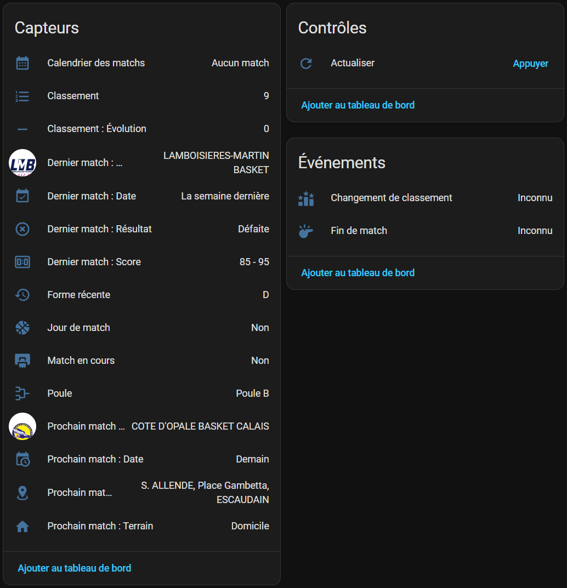
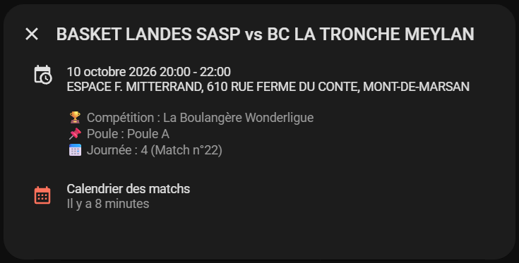

[](README.md) [](#)

# FFBB Tracker pour Home Assistant 🏀
[](https://github.com/hacs/integration)
[](https://github.com/Adrien40/ha-ffbb-tracker/releases)
[](LICENSE)

Une **intégration complète pour Home Assistant** qui suit les résultats, calendriers et classements de vos équipes de basketball engagées en championnats FFBB (Fédération Française de BasketBall), sans compte ni clé privée requise. 🛡️

> ℹ️ **À savoir** : Cette intégration interroge l'API publique Directus utilisée par l'application web officielle `competitions.ffbb.com`, avec le même jeton d'accès public (lecture seule) et le même User-Agent de navigateur que le site officiel. Aucun compte ni identifiant personnel n'est nécessaire. Elle récupère l'ensemble des rencontres, résultats et classements de la poule en une seule requête optimisée.

Si ce projet vous est utile, vous pouvez soutenir son développement 🙏

<a href="https://www.buymeacoffee.com/adrien40"></a>

---

## ⚡ En résumé
- 🏀 Suivi complet de vos équipes préférées (Départemental, Régional, National)
- 📅 Calendrier complet des matchs synchronisé nativement dans Home Assistant
- ⏱️ Prochain match en direct : date, adversaire, statut domicile ou extérieur
- 📍 Itinéraires en un clic : liens directs Google Maps et Waze vers la salle générés automatiquement dans les attributs
- 🏆 Dernier match joué : score, adversaire et issue de la rencontre (victoire, défaite, nul)
- 📊 Classement de la poule et suivi dynamique de l'évolution de la position (gain/perte de places) avec persistance après redémarrage
- 🛠️ Trois actions de service prêtes pour vos automatisations et scripts de notifications (Telegram, alertes d'avant-match)
- 🔍 Ajout en quelques secondes : recherche par nom de club, code fédéral ou simple copier-coller de l'URL de l'équipe
- ⚙️ Installation via HACS en 2 minutes

---

## 📸 Aperçu dans Home Assistant

### 🔍 Aperçu des entités
<p align="center">
  
</p>
<p align="center">
  <em>🔍 Entités créées automatiquement pour chaque équipe suivie</em>
</p>

### 📅 Calendrier officiel
<p align="center">
  
</p>
<p align="center">
  <em>📅 Calendrier des rencontres, adresse de la salle et résultats directement dans votre calendrier</em>
</p>

---

### 💡 Pourquoi cette intégration ?
Conçue pour les joueuses, joueurs, parents et supporters de basketball amateur ou professionnel souhaitant intégrer leur passion dans leur domotique :

* **🛡️ Zéro compte à créer :** Aucun identifiant ni mot de passe personnel requis, l'intégration utilise le jeton de consultation public de l'application fédérale.
* **🚗 Guidage immédiat vers les salles :** Plus besoin de chercher l'adresse du gymnase le samedi après-midi ; l'adresse complète avec code postal et les liens de navigation GPS sont prêts sur votre tableau de bord ou dans vos alertes mobiles.
* **📈 Suivi de classement fiable :** L'évolution de votre équipe au classement (+1, -2, =) est mémorisée dans le stockage interne de Home Assistant et survit aux redémarrages sans perte d'historique.
* **⚡ Économe et respectueuse :** Une interrogation cadencée et centralisée par poule pour éviter de solliciter inutilement les serveurs fédéraux.

---

### ✅ Compatibilité et prérequis
* 🏷️ **Compétitions supportées** : Toutes les équipes et compétitions répertoriées sur `competitions.ffbb.com` (seniors, jeunes, championnats départementaux, régionaux et nationaux).
* ⚙️ **Version Home Assistant requise** : Version 2026.2.3 ou supérieure recommandée.
* 🌐 **Connexion internet** : Requise pour actualiser les données depuis les serveurs de la fédération.
* 🔍 **Recherche simple** :
  * Par nom de club ou de commune (ex. : *Basket Landes*, *Paris*).
  * Par code officiel de club (ex. : *NAQ0040141*).
  * Par URL complète de la page équipe copiée depuis `competitions.ffbb.com`.

---

### ✨ Points forts
* 📅 **Calendrier natif Home Assistant** : Visualisez l'ensemble de la saison dans la vue Calendrier avec l'heure exacte, le numéro de journée, le score final et le nom complet de la salle.
* 🚗 **Navigation GPS intégrée** : Liens profonds Waze et Google Maps prêts à l'emploi dans les attributs pour démarrer le guidage en un clic.
* 📈 **Capteur d'évolution de classement** : Calcule le gain ou la perte de position entre deux mises à jour, avec icône dynamique adaptative (flèche montante, flèche descendante ou tiret).
* 🔄 **Reconfiguration simplifiée** : Changez d'équipe ou de poule directement depuis le bouton « Reconfigurer » sans supprimer l'intégration ni laisser d'appareils fantômes dans le registre.
* 🛠️ **Actions dédiées (services)** :
  * `ffbb_tracker.refresh` : Force l'actualisation manuelle immédiate des données.
  * `ffbb_tracker.get_next_matches` : Renvoie les prochains matchs sous forme de dictionnaire exploitable par vos automatisations.
  * `ffbb_tracker.get_standings` : Renvoie la grille complète du classement de la poule (points, victoires, défaites, matchs joués).
* 🔄 **Bouton d'actualisation manuelle** : Une entité `button` pour forcer la mise à jour des données à tout moment sans attendre le cycle de scrutation.
* ⚙️ **Cadence dynamique et suivi de direct** : Réglez l'intervalle de base (15 à 1 440 min), activez l'accélération les jours de match (2 à 15 min) et ajustez la fenêtre d'attente du score.

---

### 🚀 Installation

#### Via HACS (recommandé)
Ce dépôt n'étant pas encore dans la liste officielle par défaut, vous pouvez l'ajouter facilement en tant que dépôt personnalisé.

1. Ouvrez **HACS** dans votre interface Home Assistant.
2. Cliquez sur les 3 petits points en haut à droite et sélectionnez **Dépôts personnalisés**.
3. Dans le champ **Dépôt**, collez l'adresse : `https://github.com/Adrien40/ha-ffbb-tracker`
4. Dans le menu déroulant **Type**, choisissez **Intégration** puis cliquez sur **Ajouter**.
5. Une fois ajouté, cliquez sur **Télécharger** sur la fiche de l'intégration qui apparaît (sélectionnez la dernière version).
6. **Redémarrez complètement Home Assistant**.
7. Rendez-vous dans **Paramètres** > **Appareils et services** > **Ajouter une intégration**, puis cherchez **FFBB Tracker**.

#### Installation manuelle
1. Téléchargez la dernière archive depuis la page des [Releases](https://github.com/Adrien40/ha-ffbb-tracker/releases).
2. Copiez le dossier `custom_components/ffbb_tracker` dans le dossier `custom_components` situé à la racine de votre configuration Home Assistant.
3. Redémarrez Home Assistant.

---

### 📊 Capteurs et entités disponibles

Chaque équipe configurée crée un appareil dédié regroupant 11 capteurs, 1 bouton et 1 calendrier :

| Entité | Classe / Unité | Description |
| :--- | :--- | :--- |
| 🔄 **Actualiser** | Bouton | Déclenche immédiatement une mise à jour manuelle des données de l'équipe. |
| 🗓️ **Calendrier des matchs** | Calendrier | Calendrier officiel regroupant tous les matchs prévus et terminés de la poule. |
| 📊 **Classement** | Entier | Position actuelle de l'équipe dans sa poule. *(Contient le tableau complet du classement en attribut)* |
| 📈 **Classement : Évolution** | Texte | Évolution de la position (`+1`, `-2`, `0`) avec icône adaptative. |
| 📅 **Dernier match : Date** | Timestamp | Date et heure du dernier match joué. |
| 👥 **Dernier match : Équipe** | Texte | Nom du dernier adversaire affronté. |
| 🏆 **Dernier match : Résultat** | Statut | Résultat du dernier match : **Victoire** (`win`), **Défaite** (`loss`) ou **Nul** (`draw`). |
| 🔢 **Dernier match : Score** | Texte | Score final formaté (ex. : `78 - 65`). |
| 🏆 **Poule** | Texte | Intitulé officiel de la poule et de la phase en cours. |
| 📅 **Prochain match : Date** | Timestamp | Date et heure de début de la prochaine rencontre programmée. |
| 👥 **Prochain match : Équipe** | Texte | Nom de l'adversaire du prochain match. *(Contient la salle et les URL Maps / Waze en attributs)* |
| 📍 **Prochain match : Lieu** | Texte | Adresse complète formatée de la salle où se dispute la rencontre. |
| 🏟️ **Prochain match : Terrain** | Statut | Indique si la rencontre a lieu à **Domicile** (`home`) ou à l'**Extérieur** (`away`). |

---

### 🗺️ Attributs de navigation GPS

Les entités `next_match_location` (Lieu) et `next_match_opponent` (Équipe) exposent des attributs riches pour préparer vos déplacements :

* `gym_name` : nom du gymnase ou du complexe sportif
* `gym_address` : rue ou lieu-dit
* `gym_city` : commune
* `google_maps_url` : lien direct de guidage vers la salle pour Google Maps
* `waze_url` : lien de lancement immédiat de navigation pour l'application Waze

---

### 🚀 Configuration

1. Rendez-vous dans **Paramètres** > **Appareils et services**.
2. Cliquez sur **Ajouter une intégration** et recherchez **FFBB Tracker**.
3. Renseignez votre recherche dans le formulaire :
   * **Recherche par club** : tapez quelques lettres du nom du club (ex. : `Bordeaux` ou `Basket Landes`). Sélectionnez ensuite le club souhaité, puis l'équipe engagée dans la liste proposée.
   * **Recherche directe** : collez directement l'adresse web de l'équipe copiée depuis le site fédéral (ex. : `https://competitions.ffbb.com/equipes/123456789`) ou collez simplement l'identifiant numérique de l'engagement.
4. La détection de la poule et de la compétition est automatique.

---

### 🛠️ Actions et automatisations (exemples)

#### Exemple : notification Telegram le matin du match
```yaml
alias: "Basket - Rappel de Match"
trigger:
  - platform: time
    at: "09:00:00"
condition:
  - condition: template
    value_template: >-
      {{ as_timestamp(states('sensor.mon_equipe_prochain_match_date')) | timestamp_custom('%Y-%m-%d') == now().strftime('%Y-%m-%d') }}
action:
  - action: telegram_bot.send_message
    data:
      message: >-
        🏀 Match aujourd'hui !
        Adversaire : {{ states('sensor.mon_equipe_prochain_match_equipe') }}
        Terrain : {{ states('sensor.mon_equipe_prochain_match_terrain') }}
        Heure : {{ as_timestamp(states('sensor.mon_equipe_prochain_match_date')) | timestamp_custom('%Hh%M') }}
        Lieu : {{ states('sensor.mon_equipe_prochain_match_lieu') or 'Non renseigné' }}

        Itinéraire : {{ state_attr('sensor.mon_equipe_prochain_match_lieu', 'waze_url') }}
      entity_id:
        - notify.telegram
```

---

### 🐛 Dépannage

<details>
<summary>⚠️ Consulter les questions fréquentes</summary>

* **Aucune équipe trouvée lors de la recherche par club** : Certaines associations sportives n'ont pas encore engagé leurs équipes pour la phase suivante, ou la poule n'est pas encore publiée par le comité ou la ligue.
* **Le lien GPS m'amène au centre-ville et non au gymnase** : Sur certaines petites salles, la commune n'a pas renseigné d'adresse précise auprès de la fédération. Le lien utilise alors le nom de la salle et la ville pour optimiser le calcul d'itinéraire.
* **Le capteur d'évolution affiche 0 après un redémarrage** : C'est normal lors de la toute première installation ; dès la prochaine actualisation du classement par la FFBB, le différentiel réel (+1, -1, etc.) sera automatiquement calculé et préservé.

</details>

---

### 🌐 Langues supportées

L'intégration est entièrement disponible en **Français**  et en **Anglais**  (interface de configuration, entités et calendrier).

Si vous souhaitez voir l'intégration traduite dans une autre langue ou contribuer à une traduction, vous pouvez ouvrir une [issue](https://github.com/Adrien40/ha-ffbb-tracker/issues) ou me contacter directement sur GitHub.

---

### 🤝 Contributions et support
Pour tout bug ou demande d'amélioration, merci d'ouvrir une [Issue](https://github.com/Adrien40/ha-ffbb-tracker/issues) sur ce dépôt.

### ⚖️ Licence et avertissement
Projet sous licence **GPLv3**. Il s'agit d'un projet indépendant, sans aucun lien officiel avec la Fédération Française de BasketBall (FFBB). L'utilisation de ce logiciel se fait sous votre propre responsabilité.

---

**Développé avec ❤️ par @Adrien40**

<a href="https://www.buymeacoffee.com/adrien40"></a>

<!-- Keywords: Home Assistant custom integration, FFBB, Basketball, scores, standings, calendar, sports tracker, local automation -->
